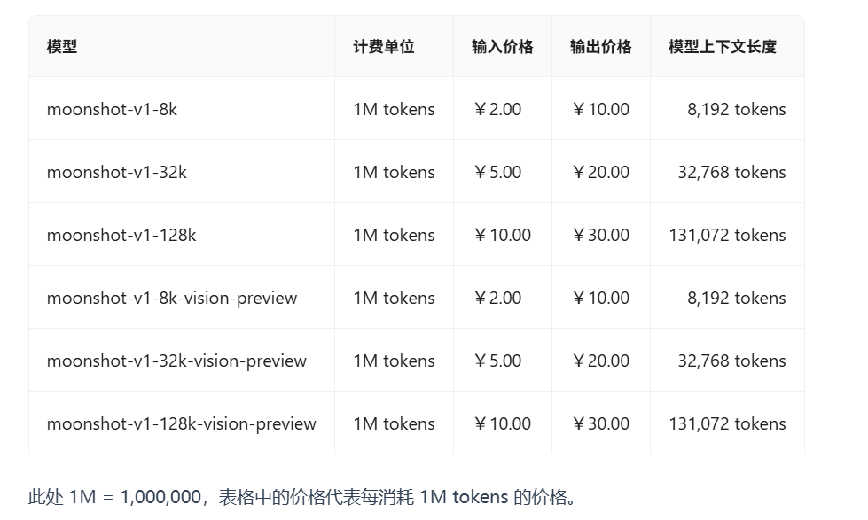
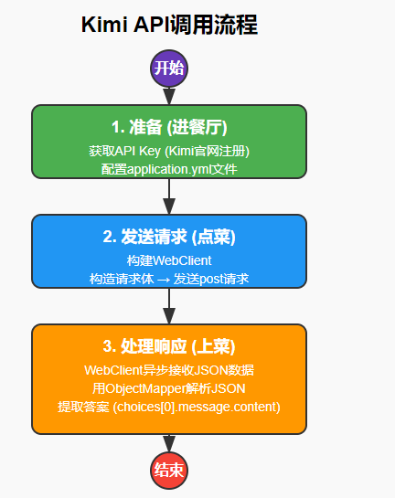

# 大模型Kimi AI 集成指南

## 1. Kimi AI文本生成模型

Moonshot的文本生成模型（指moonshot-v1）是训练用于理解自然语言和书面语言的，它可以根据输入生成文本输出。对模型的输入也被称为“prompt”。通常我们建议您提供明确的指令以及给出一些范例，来让模型能够完成既定的任务，设计 prompt 本质上就是学会如何“训练”模型。moonshot-v1模型可以用于各种任务，包括内容或代码生成、摘要、对话、创意写作等。

**对于我们的项目，Kimi 能做什么？**

- **智能出题**：我们可以告诉 Kimi：“帮我出10道关于 Java 基础的选择题”，它就能自动生成题目。
- **内容润色**：可以把我们写的公告、题目描述发给 Kimi，让它帮忙润色，使语言更专业。
- **智能判卷**：智能判断考试的简单题，并且对考试进行点评。

简单来说，通过 API 调用 Kimi，就是把一个“超级大脑”集成到了我们自己的程序里，让我们的应用变得更智能。

模型官网：https://platform.moonshot.cn/docs/overview

## 2. 模型核心概念

### Token

文本生成模型以 Token 为基本单位来处理文本。Token 代表常见的字符序列。例如，单个汉字"夔"可能会被分解为若干 Token 的组合，而像"中国"这样短且常见的短语则可能会使用单个 Token。大致来说，对于一段通常的中文文本，1 个 Token 大约相当于 1.5-2 个汉字。

需要注意的是，对于我们的文本模型，Input 和 Output 的总和长度不能超过模型的最大上下文长度。

### 速率限制

速率限制通过4种方式衡量：并发、RPM（每分钟请求数）、TPM（每分钟 Token 数）、TPD（每天 Token 数）。速率限制可能会在任何一种选项中达到，取决于哪个先发生。例如，你可能向 ChatCompletions 发送了 20 个请求，每个请求只有 100 个 Token ，那么你就达到了限制（如果你的 RPM 限制是 20），即使你在这些 20 个请求中没有发满 200k 个 Token （假设你的TPM限制是 200k）。

对网关，出于方便考虑，我们会基于请求中的 max_tokens 参数来计算速率限制。这意味着，如果你的请求中包含了 max_tokens 参数，我们会使用这个参数来计算速率限制。如果你的请求中没有包含 max_tokens 参数，我们会使用默认的 max_tokens 参数来计算速率限制。当你发出请求后，我们会基于你请求的 token 数量加上你 max_tokens 参数的数量来判断你是否达到了速率限制。而不考虑实际生成的 token 数量。

而在计费环节中，我们会基于你请求的 token 数量加上实际生成的 token 数量来计算费用。

### 大模型

Kimi当前支持的模型有：

- `moonshot-v1-8k`: 它是一个长度为 8k 的模型，适用于生成短文本。
- `moonshot-v1-32k`: 它是一个长度为 32k 的模型，适用于生成长文本。
- `moonshot-v1-128k`: 它是一个长度为 128k 的模型，适用于生成超长文本。
- `moonshot-v1-8k-vision-preview`: 它是一个长度为 8k 的 Vision 视觉模型，能够理解图片内容，输出文本。
- `moonshot-v1-32k-vision-preview`: 它是一个长度为 32k 的 Vision 视觉模型，能够理解图片内容，输出文本。
- `moonshot-v1-128k-vision-preview`: 它是一个长度为 128k 的 Vision 视觉模型，能够理解图片内容，输出文本。



以上模型的区别在于它们的最大上下文长度，这个长度包括了输入消息和生成的输出，在效果上并没有什么区别。

## 3. API 调用基本概念

在我们写代码之前，先理解几个和 Kimi 对话的“规矩”（也就是 API 的基本概念）。

- **API (Application Programming Interface)**：应用程序编程接口。通俗点说，就是KIMI功能对外暴漏的访问地址！对话Chat模式地址为：https://api.moonshot.cn/v1/chat/completions

    详情参考官方文档：https://platform.moonshot.cn/docs/api/chat#chat-completion

- **API Key (密钥)**：就像你的会员卡号。每次去餐厅点菜，你都要出示会员卡，才知道扣谁的钱，基本所有收费的公共接口都需要秘钥！注册以后，可以在我们的[控制台](https://platform.moonshot.cn/console)中创建一个 API 密钥。

- **HTTP 请求 (Request)**：就是我们“点菜”的过程。我们用程序模拟浏览器，向 Kimi 的服务器地址发送一个 POST 请求。请求里包含了我们的“菜单”信息。

- **请求体 (Request Body)**：通常是一个 JSON 格式的文本，里面写清楚了我们要 Kimi 做什么。比如：
  
    ```json
    {
    "model": "kimi-k2-0711-preview",
        "messages": [
            {
                "role": "system",
                "content": "你是 Kimi，由 Moonshot AI 提供的人工智能助手，你更擅长中文和英文的对话。你会为用户提供安全，有帮助，准确的回答。同时，你会拒绝一切涉及恐怖主义，种族歧视，黄色暴力等问题的回答。Moonshot AI 为专有名词，不可翻译成其他语言。"
            },
            { "role": "user", "content": "你好，我叫李雷，1+1等于多少？" }
        ],
        "temperature": 0.6
    }
    
    ```
    
    - `model`: 要用哪个版本的 Kimi 模型（比如 `moonshot-v1-8k`）。
    - `messages`: 我们想对 Kimi 说的话，这是核心部分。
    - `temperature`: 一个控制“创造力”的参数。值越低，回答越严谨；值越高，回答越有想象力。
    
    详情可以参考官网：https://platform.moonshot.cn/docs/api/chat#%E8%AF%B7%E6%B1%82%E5%86%85%E5%AE%B9
    
- **响应 (Response)**：厨房（Kimi）做好的“菜”。服务器会返回一个 JSON 格式的文本，里面包含了 Kimi 生成的回答。

    ```json
    {
        "id": "cmpl-04ea926191a14749b7f2c7a48a68abc6",
        "object": "chat.completion",
        "created": 1698999496,
        "model": "kimi-k2-0711-preview",
        "choices": [
            {
                "index": 0,
                "message": {
                    "role": "assistant",
                    "content": " 你好，李雷！1+1等于2。如果你有其他问题，请随时提问！"
                },
                "finish_reason": "stop"
            }
        ],
        "usage": {
            "prompt_tokens": 19,
            "completion_tokens": 21,
            "total_tokens": 40
        }
    }
    ```

    错误码官网地址：

    https://platform.moonshot.cn/docs/api/chat#%E9%94%99%E8%AF%AF%E8%AF%B4%E6%98%8E

调用 Kimi API 的整个过程非常清晰，我们总结如下：



## 4. 远程调用工具：`WebClient`

>  在现代 Spring Boot 开发中，我们推荐使用 `WebClient` 来代替旧的 `RestTemplate`。

### 为什么要用 `WebClient`?
- **性能更好 (非阻塞)**: `RestTemplate` 是同步阻塞的，一个请求发出去，程序会死等在那，直到对方响应。如果对方很慢，我们的程序就会被卡住。`WebClient` 是异步非阻塞的，发出请求后可以先去干别的事，等对方响应了再来处理，效率更高，能用更少的服务器资源处理更多的请求。
- **代码更优雅 (响应式)**: `WebClient` 使用链式调用，代码写起来像流水一样，可读性更强。

### 步骤 1: 添加 `WebFlux` 依赖

要使用 `WebClient`，必须在 `pom.xml` 中添加 `spring-boot-starter-webflux` 依赖。

```xml
<!-- pom.xml -->
<dependency>
    <groupId>org.springframework.boot</groupId>
    <artifactId>spring-boot-starter-webflux</artifactId>
</dependency>
```
> **注意**: 即使你的项目是传统的 MVC 项目，也可以安全地引入此依赖来使用 `WebClient`。

### 步骤 2: 核心代码 `KimiAiService`

下面是用 `WebClient` 实现的 `KimiAiServiceImpl` 的核心代码。

**`KimiCallTest.java` (WebClient 版本)**

```java
@SpringBootTest
public class KimiCallTest {

    private String apiKey = "sk-0FjcIWCa6i6jvSu3RMHVk8ujkL8FcsoRvtkg119jij7FQB2T";

    private String kimiBaseUrl = "https://api.moonshot.cn/v1";

    // 初始化WebClient
    private final WebClient webClient = WebClient.builder()
            .baseUrl(kimiBaseUrl+ "/chat/completions")
            .defaultHeader(HttpHeaders.CONTENT_TYPE, MediaType.APPLICATION_JSON_VALUE)
        	
            .defaultHeader("Authorization", "Bearer " + apiKey)
            .build();

    @Test
    public void testChat(){

        // 1. 构建消息列表（包含system和user角色）
        List<Map<String, String>> messages = new ArrayList<>();

        // 系统消息
        Map<String, String> systemMsg = new HashMap<>();
        systemMsg.put("role", "system");
        systemMsg.put("content", "你是 Kimi，由 Moonshot AI 提供的人工智能助手，你更擅长中文和英文的对话。你会为用户提供安全，有帮助，准确的回答。同时，你会拒绝一切涉及恐怖主义，种族歧视，黄色暴力等问题的回答。Moonshot AI 为专有名词，不可翻译成其他语言。");
        messages.add(systemMsg);

        // 用户消息
        Map<String, String> userMsg = new HashMap<>();
        userMsg.put("role", "user");
        userMsg.put("content", "我是赵伟风，请问 1+1等于多少？");
        messages.add(userMsg);

        // 2. 构建请求体（包含模型、消息和参数）
        Map<String, Object> requestBody = new HashMap<>();
        requestBody.put("model", "moonshot-v1-32k"); // 指定Kimi模型
        requestBody.put("messages", messages);
        requestBody.put("temperature", 0.6); // 温度参数

        Mono<String> mono = webClient.post().bodyValue(requestBody).retrieve()
                .bodyToMono(String.class)
                .map(response -> {
                    // 解析响应JSON，提取回答内容
                    ObjectMapper objectMapper = new ObjectMapper();
                    JsonNode jsonNode = null;
                    try {
                        jsonNode = objectMapper.readTree(response);
                    } catch (JsonProcessingException e) {
                        throw new RuntimeException(e);
                    }
                    return jsonNode
                            .get("choices")
                            .get(0)
                            .get("message")
                            .get("content")
                            .asText();
                });

        String block = mono.block();
        System.out.println("block = " + block);
    }
}
```

### 代码讲解
- **`WebClient.create()`**: 创建一个 `WebClient` 客户端。
- **`.post().uri(...)`**: 指定我们要用 POST 方法访问哪个网址。
- **`.header(...)`**: 添加 HTTP 头信息。这里我们添加了 `Authorization` 头，用于身份认证，它的值是 `Bearer ` 加上你的 API Key。
- **`.contentType(...)`**: 明确告诉服务器，我们发过去的数据是 JSON 格式的。
- **`.bodyValue(body)`**: 把我们创建的 `Map` 对象（请求体）放进请求里。`WebClient` 会自动把它转成 JSON 字符串。
- **`.retrieve()`**: 发送请求。
- **`.bodyToMono(String.class)`**: 声明我们期望服务器返回一个字符串。`Mono` 是一个代表“未来某个时刻会返回0个或1个结果”的对象。这是响应式编程的核心概念。
- **`.block()`**: 这是从异步到同步的“桥梁”。因为我们的业务方法需要立刻返回一个 `String` 结果，所以我们用 `.block()` 来暂停代码，一直等到 `Mono` 中的数据返回为止。
- **`ObjectMapper`**: 这是 Jackson 库的工具，非常擅长在 Java 对象和 JSON 字符串之间进行转换。我们用它来解析 Kimi 返回的复杂 JSON，并用 `.get()` 方法像寻宝一样，一步步找到我们真正需要的答案。

## 5. 测试
执行测试类，注意网络情况！